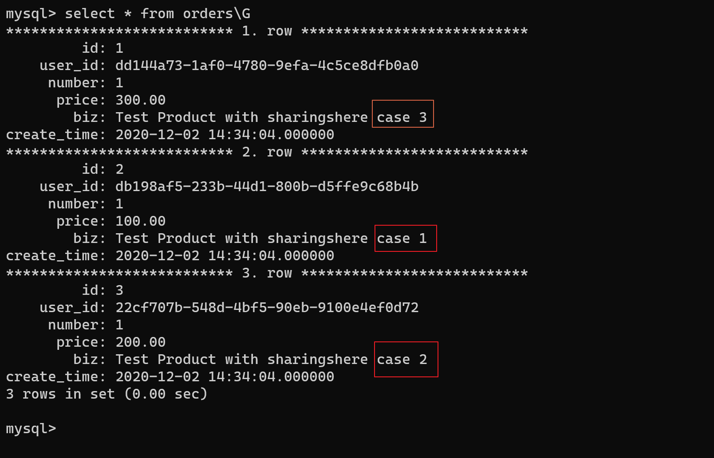

###### 作业

1. 周四 `com.geekbang.week07.task01.PerformanceTestWithBatch` 

   - ​	Week06的作业orders表添加了外键，导致插入不方便，修改了DDL，去除了所有外键

   - ​	测试插入10条数据，验证代码无误

   - ​	测试插入10万条数据

   ​		`21:42:05.553 [main] INFO com.geekbang.week07.task01.PerformanceTestWithBatch - start：1606916525551
   ​    21:43:21.164 [main] INFO com.geekbang.week07.task01.PerformanceTestWithBatch - end：1606916601164
   ​	21:43:21.164 [main] INFO com.geekbang.week07.task01.PerformanceTestWithBatch - 成功插入：100000`

   - ​    测试插入100万条数据

     `21:45:59.194 [main] INFO com.geekbang.week07.task01.PerformanceTestWithBatch - start：1606916759192
     22:00:57.961 [main] INFO com.geekbang.week07.task01.PerformanceTestWithBatch - end：1606917657961
     22:00:57.961 [main] INFO com.geekbang.week07.task01.PerformanceTestWithBatch - 成功插入：1000000`

2. 周六作业在 `com.geekbang.week07.ShardingshereJDBCTests`

   - 测试work2_1时，发现orders表的user_id字段如果为int类型，一时不知道如何插入随机数，修改为varchar类型

     

   - 单元测试结果

     

   -  数据库查询结果

     