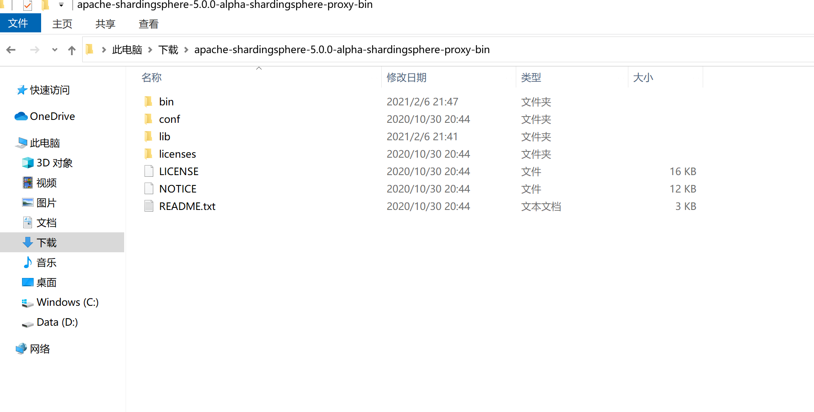
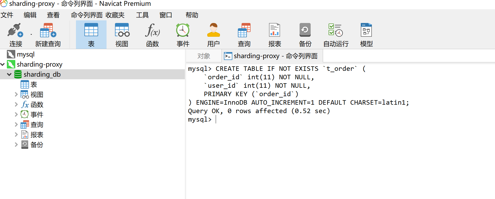
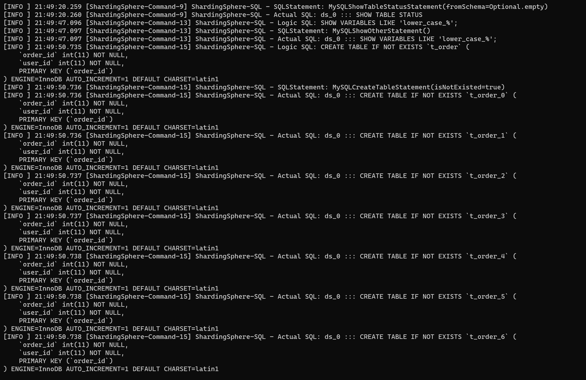

# Sharing Proxy Demo
***
## 作业说明
*设计对前面的订单表数据进行水平分库分表，拆分2个库，每个库16张表并在新结构在演示常见的增删改查操作*

### 环境配置
#### 设置MySQL
&ensp;&ensp;&ensp;&ensp;使用docker设置mysql

```shell script
# 启动两个mysql
docker run --name mysql11 -p 3311:3306 -e MYSQL_ROOT_PASSWORD=root -e MYSQL_ROOT_HOST=% -d mysql:latest
docker run --name mysql12 -p 3312:3306 -e MYSQL_ROOT_PASSWORD=root -e MYSQL_ROOT_HOST=% -d mysql:latest

# 在11上创建数据库demo_ds_0
docker exec -ti mysql11 mysql -u root -p
create database demo_ds_0;

# 在12上创建数据库demo_ds_1
docker exec -ti mysql12 mysql -u root -p
create database demo_ds_1;
```

#### ShardingSphere Proxy 5.0.0 alpha 设置
- 1.下载[ShardingSphere-Proxy](https://www.apache.org/dyn/closer.cgi/shardingsphere/5.0.0-alpha/apache-shardingsphere-5.0.0-alpha-shardingsphere-proxy-bin.tar.gz)，下载完成后放到自己相应的目录下

  

- 2.下载[MySQL-connect.jar](https://repo1.maven.org/maven2/mysql/mysql-connector-java/5.1.47/mysql-connector-java-5.1.47.jar),下载完成后将jar文件放到Sharding根目录的lib目录下

&ensp;&ensp;&ensp;&ensp;下面需要配置两个文件：server.yaml、config-sharding.yaml,示例如下（配置都有默认示例说明的，相应进行修改即可）

&ensp;&ensp;&ensp;&ensp;server.yaml

```yaml
#
# Licensed to the Apache Software Foundation (ASF) under one or more
# contributor license agreements.  See the NOTICE file distributed with
# this work for additional information regarding copyright ownership.
# The ASF licenses this file to You under the Apache License, Version 2.0
# (the "License"); you may not use this file except in compliance with
# the License.  You may obtain a copy of the License at
#
#     http://www.apache.org/licenses/LICENSE-2.0
#
# Unless required by applicable law or agreed to in writing, software
# distributed under the License is distributed on an "AS IS" BASIS,
# WITHOUT WARRANTIES OR CONDITIONS OF ANY KIND, either express or implied.
# See the License for the specific language governing permissions and
# limitations under the License.
#

######################################################################################################
# 
# If you want to configure governance, authorization and proxy properties, please refer to this file.
# 
######################################################################################################
#
#governance:
#  name: governance_ds
#  registryCenter:
#    type: ZooKeeper
#    serverLists: localhost:2181
#    props:
#      retryIntervalMilliseconds: 500
#      timeToLiveSeconds: 60
#      maxRetries: 3
#      operationTimeoutMilliseconds: 500
#  overwrite: false

authentication:
  users:
    root:
      password: root
    sharding:
      password: sharding
      authorizedSchemas: sharding_db

props:
  max-connections-size-per-query: 1
  acceptor-size: 16  # The default value is available processors count * 2.
  executor-size: 16  # Infinite by default.
  proxy-frontend-flush-threshold: 128  # The default value is 128.
    # LOCAL: Proxy will run with LOCAL transaction.
    # XA: Proxy will run with XA transaction.
    # BASE: Proxy will run with B.A.S.E transaction.
  proxy-transaction-type: LOCAL
  proxy-opentracing-enabled: false
  proxy-hint-enabled: false
  query-with-cipher-column: true
  sql-show: true
  check-table-metadata-enabled: false
```

&ensp;&ensp;&ensp;&ensp;config-sharding.yaml

```yaml
######################################################################################################
#
# If you want to connect to MySQL, you should manually copy MySQL driver to lib directory.
#
######################################################################################################

schemaName: sharding_db

dataSourceCommon:
  username: root
  password: root
  connectionTimeoutMilliseconds: 30000
  idleTimeoutMilliseconds: 60000
  maxLifetimeMilliseconds: 1800000
  maxPoolSize: 50
  minPoolSize: 1
  maintenanceIntervalMilliseconds: 30000

dataSources:
  ds_0:
    url: jdbc:mysql://127.0.0.1:3311/demo_ds_0?serverTimezone=UTC&useUnicode=true&characterEncoding=utf-8&useSSL=false&allowPublicKeyRetrieval=true
  ds_1:
    url: jdbc:mysql://127.0.0.1:3312/demo_ds_1?serverTimezone=UTC&useUnicode=true&characterEncoding=utf-8&useSSL=false&allowPublicKeyRetrieval=true

rules:
- !SHARDING
  tables:
    t_order:
      actualDataNodes: ds_${0..1}.t_order_${0..15}
      tableStrategy:
        standard:
          shardingColumn: order_id
          shardingAlgorithmName: t_order_inline
#      keyGenerateStrategy:
#        column: order_id
#        keyGeneratorName: snowflake
#    t_order_item:
#      actualDataNodes: ds_${0..1}.t_order_item_${0..1}
#      tableStrategy:
#        standard:
#          shardingColumn: order_id
#          shardingAlgorithmName: t_order_item_inline
#      keyGenerateStrategy:
#        column: order_item_id
#        keyGeneratorName: snowflake
#  bindingTables:
#    - t_order,t_order_item
  defaultDatabaseStrategy:
    standard:
      shardingColumn: user_id
      shardingAlgorithmName: database_inline
#  defaultTableStrategy:
#    none:
#  
  shardingAlgorithms:
    database_inline:
      type: INLINE
      props:
        algorithm-expression: ds_${user_id % 2}
    t_order_inline:
      type: INLINE
      props:
        algorithm-expression: t_order_${order_id % 16}
#    t_order_item_inline:
#      type: INLINE
#      props:
#        algorithm-expression: t_order_item_${order_id % 2}
#  
#  keyGenerators:
#    snowflake:
#      type: SNOWFLAKE
#      props:
#        worker-id: 123
```


&ensp;&ensp;&ensp;&ensp;OK，一切准备就绪，直接进入sharding的根目录下的bin目录中运行：start.bat即可（也可以在命令行中运行）

```shell script
# 使用命令行运行可以指定运行端口
./start.bat 13306
```

&ensp;&ensp;&ensp;&ensp;成功以后刷刷刷的一排日志打出，没有错误就说明可以运行了

&ensp;&ensp;&ensp;&ensp;使用mysql命令或者navicat之类的数据库客户端连接上sharding，运行下面的SQL语句生成测试的表，运行成功看到日志中一大批SQL语句，



```sql
CREATE TABLE IF NOT EXISTS `t_order` (
    `order_id` int(11) NOT NULL,
    `user_id` int(11) NOT NULL,
    PRIMARY KEY (`order_id`)
) ENGINE=InnoDB AUTO_INCREMENT=1 DEFAULT CHARSET=latin1;
```



### SpringBoot Mybatis配置

&ensp;&ensp;&ensp;&ensp;需要修改数据库连接配置，大致如下：

```properties
# mybatis的config文件位置配置
mybatis.config-location=classpath:mybatis/mybatis-config.xml
# 各个表的xml文件位置配置
mybatis.mapper-locations=classpath:mybatis/mapper/*.xml
mybatis.type-aliases-package=com.neo.model

# 数据库连接信息配置，自行更换数据库，用户名和密码,配置为ShardingSphereProxy
spring.datasource.url=jdbc:mysql://localhost:13306/sharding_db?serverTimezone=UTC&useUnicode=true&characterEncoding=utf-8\
  &useSSL=false&allowPublicKeyRetrieval=true
spring.datasource.username=root
spring.datasource.password=root
spring.datasource.driver-class-name=com.mysql.cj.jdbc.Driver
```


