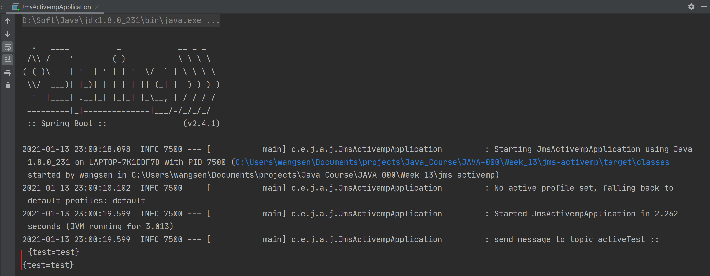
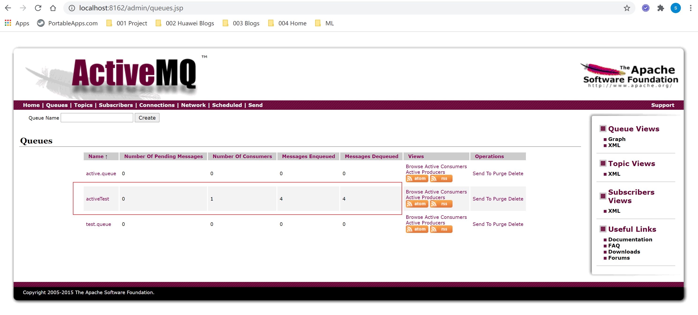

# Activemq Jms 简单示例
***
## 简介
&ensp;&ensp;&ensp;&ensp;简单的 Activemp JMS 示例代码

### activemq 运行
&ensp;&ensp;&ensp;&ensp;简单使用docker启动一个：

```shell script
docker run -d --name activemq -p 61617:61616 -p 8162:8161 webcenter/activemq
```

### springboot 主程序运行



### ActiveMQ管理界面

