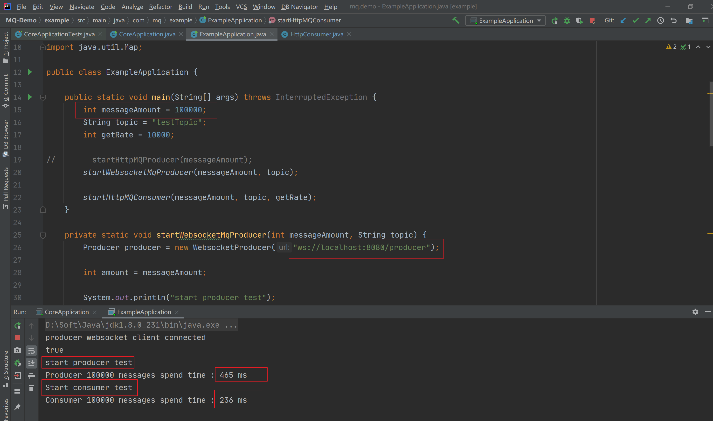
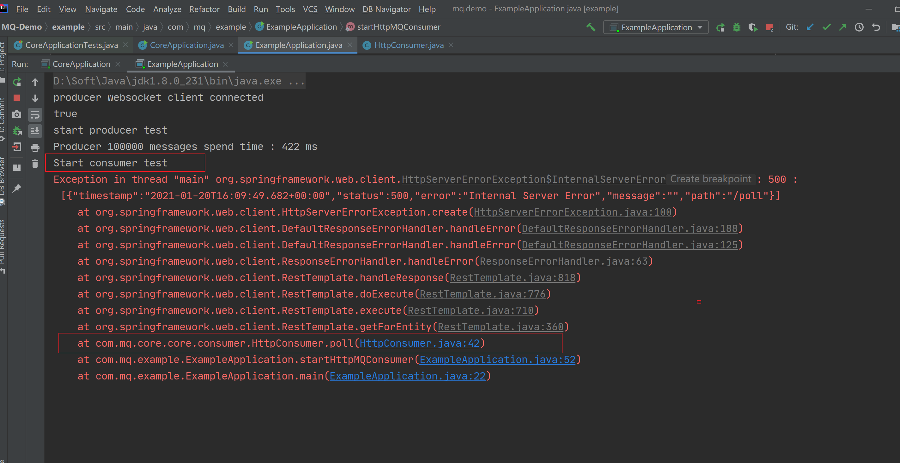

## 动手写MQ

### 第一个版本：内存 Queue

- [x] 1、基于内存Queue实现生产和消费API（已经完成）
  - [x] 1）创建内存Queue，作为底层消息存储
  - [x] 2）定义Topic，支持多个Topic
  - [x] 3）定义Producer，支持Send消息
  - [x] 4）定义Consumer，支持Poll消息

参考优秀作业，偶发性会报错

