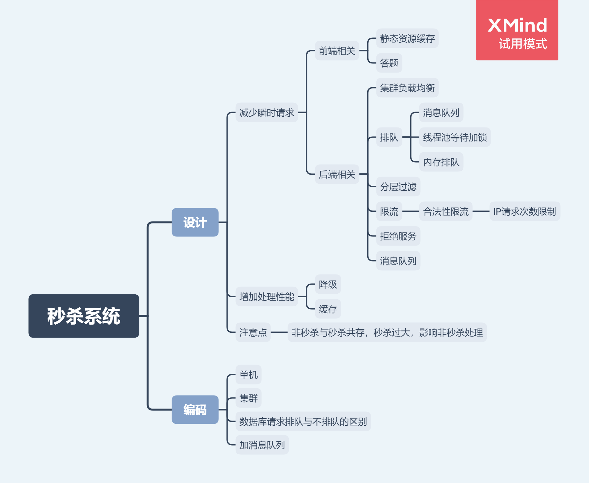

# 秒杀系统的设计
***
## 设计与编码概览

## 设计思路
### 秒杀的业务场景
核心是瞬时的请求过多，程序的性能处理不过来，导致相关的异常和错误

### 解决思路
解决的思路有两个：

- 一：减少瞬时的请求
- 二：增强程序的处理性能

#### 减少瞬时的请求
这个可以在前后端都做工作

- 前端：
  - 将静态资源之类的都缓存到CDN之类的，请求这些就不用访问处理业务的服务器，这样就减少了一部分的请求
  - 在秒杀点击的时候，加一些答题或者验证码之类的按钮，这样能增加请求的发送延时，也就是将请求的分布时间区间增加，这样也能减少瞬时请求

- 后端：
  - 通过集群负载均衡，将请求进行平均，这样也减少每个服务器的瞬时请求
  - 使用消息队列之类的技术，将请求先放到队列中，服务器再进行获取和处理，服务器按照自己的处理性能进行获取，这样也是减少瞬时的请求
  - 分层过滤：将一些不合规的请求，比如机器人刷单之类的请求给过滤掉，这样到达服务器的请求也能减少了

#### 增强处理性能

- 降级：将其他不必要的服务进行降级，将资源给秒杀核心服务，这样能增强处理性能
- 缓存：将某些放入缓存中进行读写操作，避免访问数据库之类的，速度快了，也是增强处理性能