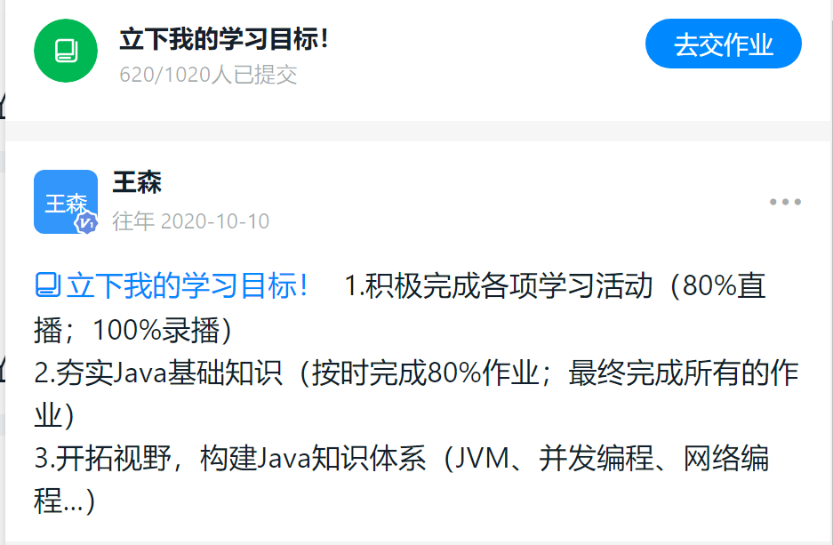
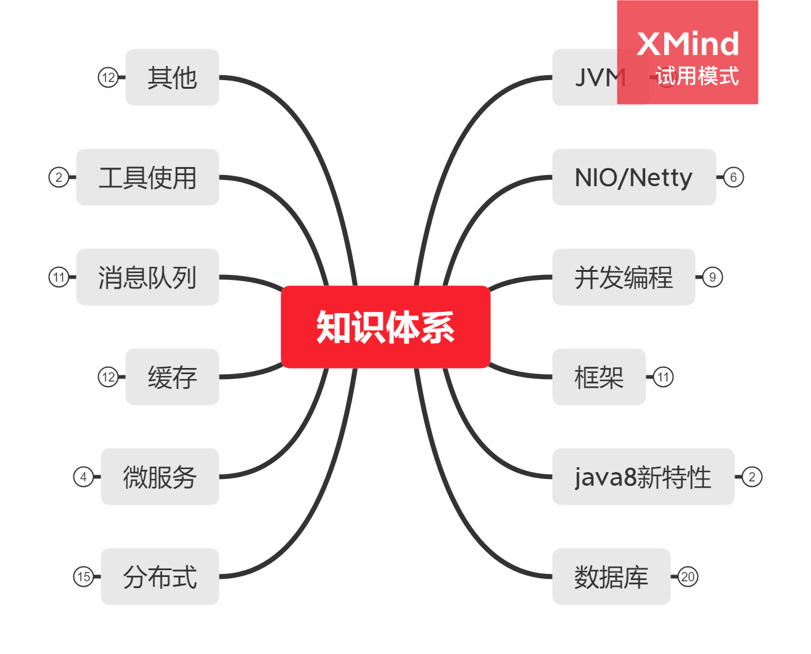

# 1.作业

 **1、(必做)** 分别用 100 个字以上的一段话，加上一幅图 (架构图或脑图)，总结自己对下列技术的关键点思考和经验认识:
1)JVM 2)NIO 3) 并发编程 4)Spring 和 ORM 等框架 5)MySQL 数据库和 SQL 6) 分库分表 7)RPC 和微服务 8) 分布式缓存 9) 分布式消息队列 

# 2.初衷

学习这门课的初衷，说来非常简单，看看阿里P7大致是什么水平，从而参照这个标准，对自身进行一个重新定位

很高兴的是，完成最初定下的flag

完成了这整个过程后，自我定位P6.5，哈哈。。。

其实非常不好意思在课堂太过活跃，从从业年限已经是一枚IT老鸟，但水平一般，看着一个个年轻、充满活力的灵魂在踊跃碰撞思维的火花，心生惭愧，后浪拍死前浪的感觉。

简单自我介绍一下，从业15年，虚长秦老师一岁，作为一个普普通通的工程师，一直缓慢成长到今天，最近的两年一直卡在华为系SE（系统工程师的角色：一个古怪的角色：1/3的项目管理+1/3的架构设计+1/3的产品经理  参考华为系级别大概17级的样子，非直属华为员工），非常渴望可以突破瓶颈

## 秦老师金句：

- 靡不有初，鲜克有终
- 平凡的人做不平凡的事
- 随时保持离开的能力

## 想要感谢的人：

- **真诚的秦老师**：带来了融入如此多个人知识体系、职场思考的好课程
- **率真的崔老师**：虽然已经是两个孩子的父亲，但依然觉得小葵花课程非常有帮助
- **反差萌的铁锚老师**：一方面是犀利的言辞，一方面是来自骨子里的热情和认真
- **无情的杀手猫大人**：非常感谢可以吸纳进入社区，虽然目前还没有任何贡献，相信未来一定会有（当然不一定只贡献代码，个人认为运营、推广等等对社区有帮助的事情，都是贡献）

## 遗留任务：

- 复习课程，认真做好笔记，尽量多的完成课程的作业题
- 努力刷Leetcode，进入华为奋斗者联盟，争取较高的定级18级

# 3.总结

## 1.JVM

- JVM（java虚拟机）是java能够一次编译，跨平台运行的核心
- java的字节码技术可以方便的了解代码底层是在如何执行的
- 通过类加载器和类的生命周期学习了解的类从编译class文件到运行的过程，类加载的的分类，如何自己实现一个类加载器，加载自定义的类
- JVM的内存模型，了解堆栈内存
- GC的执行，各代是如何操作的，不同jdk版本的GC类型是什么，有什么优缺点，如果设置和调整JVM参数，各种命令行和可视化工具的使用
- JVM调优和GC的日志分析帮助系统更好、更稳定地运行

## 2.NIO

- Socket通信模型，通过压测了解性能
- 学习IO模型，了解什么是同步异步，阻塞非阻塞
- 学习Netty框架，写简单的服务端和客户端交互代码，压测其性能，通过Netty的模型了解其为什么快，如何通过Netty实现一个网关
- 对比其他网关，Zuul，SpringGateWay等
- 网络编程这块一直了解不是很深入，需要总结下这些内容，如http，tcp，udp等协议

## 3.并发编程

- 由于cpu的多核出现，计算机也可以多线程处理任务，线程的创建，线程和进程的区别
- java中多线程的基本使用，线程的几种状态，基本api方法
- 多线程并发的线程安全问题，解决并发安全性问题，通过加锁，让某个方法或者代码片段只能一个线程操作
- 线程池的几个关键对象，线程池的基本配置，创建线程池的方式
- JUC并发包，线程之间如何协作，锁机制是什么，并发工具类，并发原子类
- java集合中线程安全和不安全的集合都有那些，ThreadLocal的使用

## 4.框架

- Spring框架基本上是企业开发的一套基本标准，可以很好的分工协作，分层开发，方便维护
- Spring的两大核心概念 IOC 和AOP
- Bean的核心原理，创建加载过程
- XML配置
- Spring的Message消息处理
- SpringBoot的出现简化的复杂的Spring配置，实现了零配置可以运行，也就是约定大于配置，在现在的开发中，基本上使用注解方式代替xml配置方式，代码可读性增强
- SpringBoot的自动注入原理，如何自定义starter
- ORM框架，hibernate，mybatis，简化了jdbc的操作，以对象和数据库表的映射方式来操作数据库

## 5.Mysql

- 数据库设计的三范式，设计的最佳实践
- mysql执行流程
- 索引原理，b+tree
- 数据库参数优化
- mysql数据库的事务，ACID，数据库的隔离级别，mysql默认是可重复度，日志和锁
- 数据库的优化，数据库引擎选择，表字段类型选择，问题定位
- mysql的主从复制，读写分离，在数据量增大的情况下可以通过主从配置，缓解主库查询压力
- 高可用配置

## 6.分库分表

- 数据库数据量达到一定程度后，读写分离等操作已经不能满足需要，需要对数据库或者表进行拆分，垂直拆分和水平拆分
- 分库分表的框架和中间件，如shardingshpere，mycat
- 数据迁移
- 分布式事务：多个服务之间的事务问题，要么都成功，要么都失败回滚，XA，TCC

## 7.RPC和微服务

- rpc远程调用，简化原理为客户端和服务端通过代理方式访问，中间数据传输通信需要序列化数据
- 分布式的服务治理，服务的注册发现，配置和元数据中心
- 服务集群和路由配置，负载均衡策略
- 服务过滤和流控
- 微服务架构的发展以及哪些场景需要使用微服务，最佳实践
- SpringCloud生态体系

## 8.分布式缓存

- 本地缓存，如HashMap或者ConcurrentHashMap等
- Hibernate和Mybatis框架的缓存，Guava Cache，Spring注解Cache
- 分布式缓存，Redis，Memcached
- 缓存策略：FIFO，LRU，设定过期时间，时间加权
- 常见问题：缓存穿透（没有命中缓存，请求大量穿透进入数据库），缓存击穿（某个key刚好失效，大量并发请求到这个key），缓存雪崩（大规模缓存失效，请求直接打到数据库上，导致数据库宕机）
- Redis的5种数据类型：string，hash，list，set，sorted set
- redis的使用场景
- redis的连接客户端：jedis，lettuce，redisson
- Spring和redis的集成，Springdata redis
- redis的高级功能
- redis的集群配置和高可用
- Hazelcast

## 9.分布式消息队列

- 系统间通信方式
- 内存队列到消息队列
- 消息模式和消息协议
- JMS和Activemq
- 消息队列Kafka
- rabbitmq和其他的一些mq

# 4.思维导图概览

